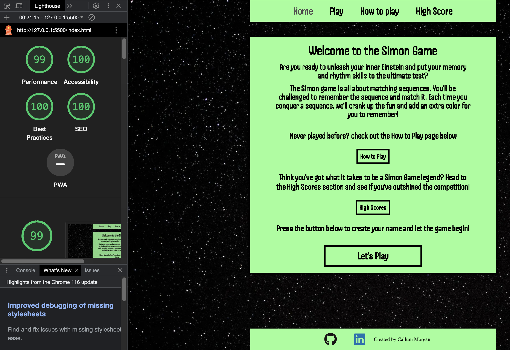
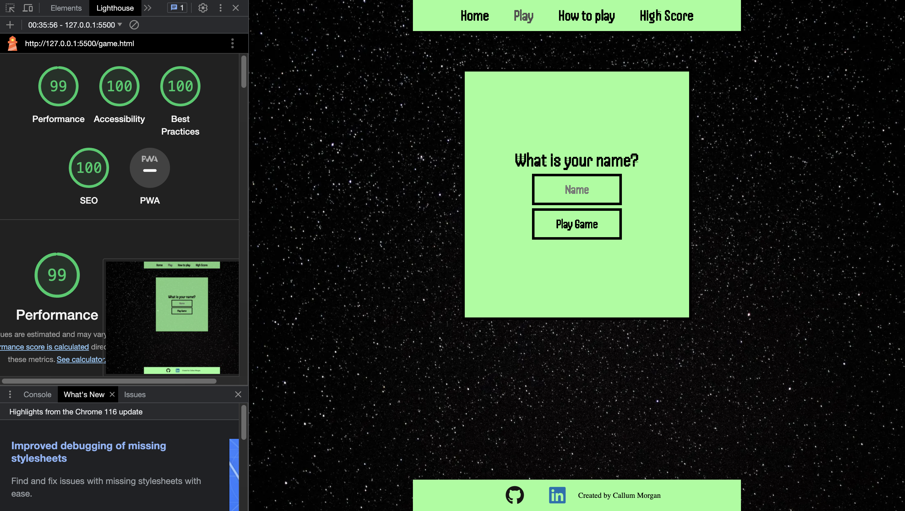
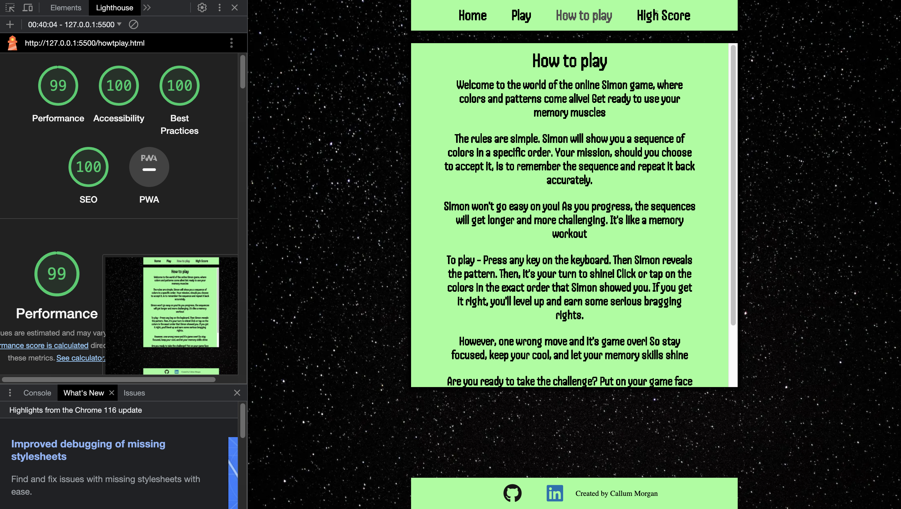
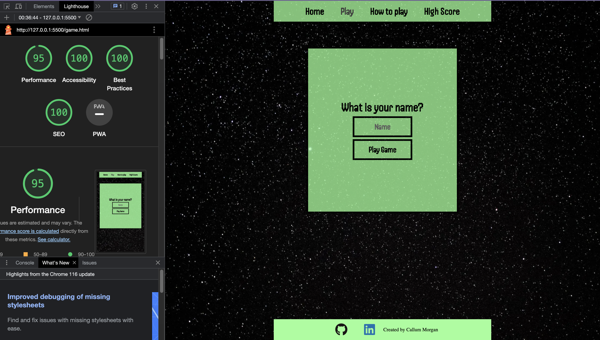
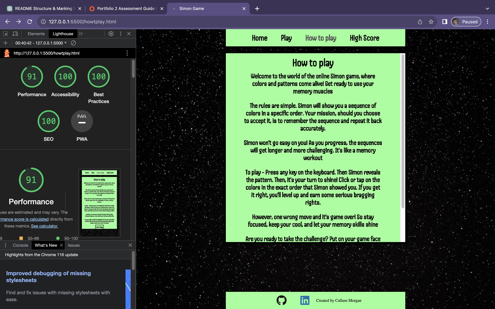
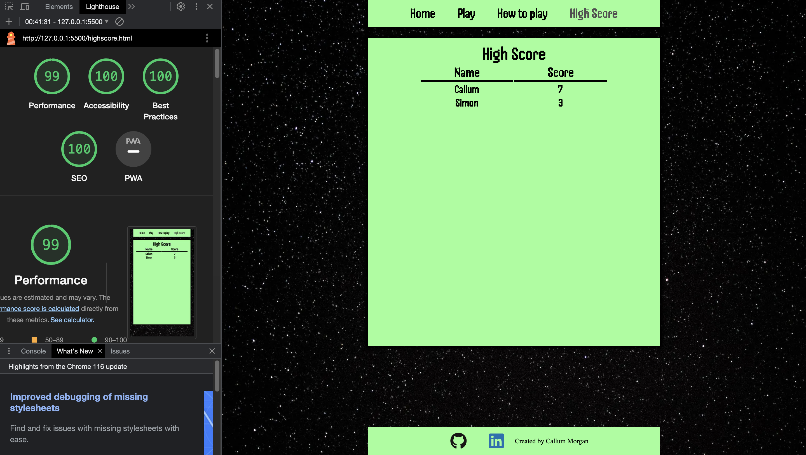

# The Simon Game

**Author:** Callum Morgan

The Simon Game is a classic memory game where players must follow and replicate a sequence of colors and sounds. This site is designed for users who want to test their memory and sequence skills. The Simon Game is a fun and engaging memory challenge that tests your ability to remember and replicate sequences. As you progress without making mistakes, your score and difficulty increases.

## Features

### Navigation

- The Navigation Menu simplifies navigation with links to Home, Play, How to Play, and Highscore pages.
- A consistent navigation menu is available on all pages for easy accessibility, and the current page is highlighted with lighter grey text for clarity.

### Landing Page

- The landing page introduces the game with a clear name and a brief overview.
- It features interactive buttons for How to Play, Highscore, and Let's Play, with a focus on the "Let's Play" button.
- Button hover effects enhance user interactivity and guide them through the page.

### Footer

- The footer includes external links to LinkedIn and GitHub, allowing users to connect and learn more about the creator.
- Hover effects on icons indicate user interaction for improved accessibility.

### Game Page

#### Form for Name

- Users are prompted to enter their username, personalizing the game experience.
- A "Play Game" button with an eye-catching design is provided, guiding users on the next steps.
- An alert prompts users to input their name if it's missing, ensuring a personalized experience.

#### Game Board

- Upon entering a username, the game board is displayed with a consistent navigation menu and footer.

#### Game Banner

- The game banner prominently displays the player's name, score, and high score.
- Scores are tracked and updated as the user plays, with each session starting at zero.

#### Call to Action Text

- Users are encouraged to start the game with a clear call to action: "Press any key to started!"

- When game is iniziated the text changes to the title of the game to feedback to the user the game has started

- When a user doesn't match the sequence the title changes to "Wrong! Try Again" to feedback to the user that the sequence is wrong.

- Displays a red background to catch the users attention to a change within the game with a soound to indicate game over.

- When a user matches the sequence the title changes to "Correct!" to feedback to the user that the sequence has been matched.

- Displays a green dark green background with the text and a small victory sound to indicate user has got a point

#### Game Board

- Game will begin the sequence by displaying a color with a pressed effect

- Each individual color has a specific sound to give the user another method of remembering a sequence

- When user presses color it will display a pressed looked to feedback to the user of the button they have clicked with the sound too to drive user engagment.

#### Sound Option

The Simon Game includes an option for controlling sound effects. Users can toggle the sound on or off based on their preference.

To enable or disable sound effects in the game, follow these steps:

- On the game page, look for the sound toggle switch located near the game board.

- As you toggle the sound switch, you will receive a confirmation message indicating whether sound is now on or off.

### Sound Icons

We use the following icons to represent the sound status:

- Sound is **ON**:

- Sound is **OFF**:

### How to Play Page

#### How to play content

- Bold Title giving user feedback on page they are on

- Description of what the simon game is, how to start it and how to play the game

- Button with "Let's play" text content navigating you to the game page to input your name. Giving users easy accessibility after reading how to play the game

- smaller media widths have a scroll effect on the text content so they can scroll down and see all the information easily

### Highscore Page

#### Score Board

- Table Indicating where name and score will display. Users name input and score will be stored and displayed on the table.

- When users input a new name and create a new score. This will also be stored on the leaderbored. If user's name has already been used in current session. The score will be updated.

- Highest score and username will be displayed at the top of the page

## Testing

The Simon Game has been tested on various browsers and devices to ensure a seamless user experience.

### Validator Testing

- #### HTML Validator

  - ##### index.html - No errors or warnings
  - ##### game.html - No errors - potential warning in regards to aria labels used correctly for misuse on colours for the game. However this is correclty used for accessibility due to screen readers being able to inform users what colour they may be interacting with
  - ##### howtoplay.html - No errors or warnings
  - ##### Index.html - No errors or warnings

- #### CSS Validator

  - ##### style.css - No errors or warnings

- #### JSLint Validator
  - ##### index.js - No errors or warnings
  - ##### game.js - startPage function is stated as an unused variable (This variable is initiated within the game.html on a "onsubmit event")
  - ##### highscore.js - No errors or warnings

### Lighthouse Report

- #### Desktop

  - ##### index.html
    
  - ##### game.html
    
  - ##### howtoplay.html
    
  - ##### highscore.html
    

- #### Mobile

  - ##### index.html
    
  - ##### game.html
    
  - ##### howtoplay.html
    
  - ##### highscore.html
    

### Bugs and fixes

- #### Extracting ID from elements

  - This bug was encountered throughout the development of javascript. When I would try and display an elements ID using the 'this' keyword. However this wouldn't work. There would be mothing through console.log.
    I rectified this by researching different methods of adding event listeners to multiple elements and how I could use the 'this' key word effectivley without it looping through all elements the event was listening for. I used the .foreach method

- #### Score doubling each time a sequence was correct

  - This was a very interesting bug that would double the score each time the sequence was correct - instead of incrementing by 1. This bug also stemmed from a for loop that would target all event listening for a 'click' event When this click was executed - it would run through the code more than once.
    This was rectified by using the .foreach method

- #### User and Score displayed on scorebored would display more each time when clicking a link or refreshing a page

  - This bug would display the user inputted and score when a user has played the game. However when you pressed a link or refreshed a page. It would add this data again. So you would have the exact same name and score displayed like a list.
    I rectified when a user is stored into local storage. I use a findIndex and take the user name input as a parameter to check within the local storage object if this name has already been entered within the session. This prevents the system from thinking this is new data. As it's normal behaviour when a page is refreshed or a link is clicked to implement the function again. I also added a feature where if the user inputs the same name - that the score will update and it will change the score on the scoreboard but wont display the name again

### Unfixed Bugs

- No unfixed bugs
