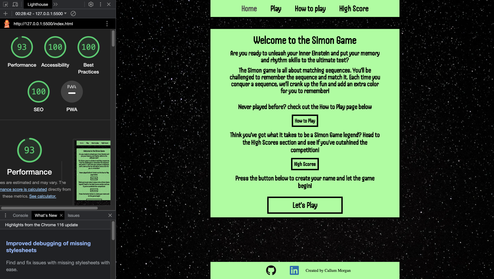

# The Simon Game

**Author:** Callum Morgan

The Simon Game is a classic memory game where players must follow and replicate a sequence of colors and sounds. This site is designed for users who want to test their memory and sequence skills. The Simon Game is a fun and engaging memory challenge that tests your ability to remember and replicate sequences. As you progress without making mistakes, your score and difficulty increases.

## Features

### Navigation

- The Navigation Menu simplifies navigation with links to Home, Play, How to Play, and Highscore pages.
- A consistent navigation menu is available on all pages for easy accessibility, and the current page is highlighted with lighter grey text for clarity.

### Landing Page

- The landing page introduces the game with a clear name and a brief overview.
- It features interactive buttons for How to Play, Highscore, and Let's Play, with a focus on the "Let's Play" button.
- Button hover effects enhance user interactivity and guide them through the page.

### Footer

- The footer includes external links to LinkedIn and GitHub, allowing users to connect and learn more about the creator.
- Hover effects on icons indicate user interaction for improved accessibility.

### Game Page

#### Form for Name

- Users are prompted to enter their username, personalizing the game experience.
- A "Play Game" button with an eye-catching design is provided, guiding users on the next steps.
- An alert prompts users to input their name if it's missing, ensuring a personalized experience.

#### Game Board

- Upon entering a username, the game board is displayed with a consistent navigation menu and footer.

#### Game Banner

- The game banner prominently displays the player's name, score, and high score.
- Scores are tracked and updated as the user plays, with each session starting at zero.

#### Call to Action Text

- Users are encouraged to start the game with a clear call to action: "Press any key to started!"

- When game is iniziated the text changes to the title of the game to feedback to the user the game has started

- When a user doesn't match the sequence the title changes to "Wrong! Try Again" to feedback to the user that the sequence is wrong.

- Displays a red background to catch the users attention to a change within the game with a soound to indicate game over.

- When a user matches the sequence the title changes to "Correct!" to feedback to the user that the sequence has been matched.

- Displays a green dark green background with the text and a small victory sound to indicate user has got a point

#### Game Board

- Game will begin the sequence by displaying a color with a pressed effect

- Each individual color has a specific sound to give the user another method of remembering a sequence

- When user presses color it will display a pressed looked to feedback to the user of the button they have clicked with the sound too to drive user engagment.

#### Sound Option

The Simon Game includes an option for controlling sound effects. Users can toggle the sound on or off based on their preference.

To enable or disable sound effects in the game, follow these steps:

- On the game page, look for the sound toggle switch located near the game board.

- As you toggle the sound switch, you will receive a confirmation message indicating whether sound is now on or off.

### Sound Icons

We use the following icons to represent the sound status:

- Sound is **ON**:

- Sound is **OFF**:

### How to Play Page

#### How to play content

- Bold Title giving user feedback on page they are on

- Description of what the simon game is, how to start it and how to play the game

- Button with "Let's play" text content navigating you to the game page to input your name. Giving users easy accessibility after reading how to play the game

- smaller media widths have a scroll effect on the text content so they can scroll down and see all the information easily

### Highscore Page

#### Score Board

- Table Indicating where name and score will display. Users name input and score will be stored and displayed on the table.

- When users input a new name and create a new score. This will also be stored on the leaderbored. If user's name has already been used in current session. The score will be updated.

- Highest score and username will be displayed at the top of the page

## Testing

The Simon Game has been tested on various browsers and devices to ensure a seamless user experience.

### Validator Testing

- #### HTML Validator

  - ##### index.html - No errors or warnings
  - ##### game.html - No errors - potential warning in regards to aria labels used correctly for misuse on colours for the game. However this is correclty used for accessibility due to screen readers being able to inform users what colour they may be interacting with
  - ##### howtoplay.html - No errors or warnings
  - ##### Index.html - No errors or warnings

- #### CSS Validator

  - ##### style.css - No errors or warnings

- #### JSLint Validator
  - ##### index.js - No errors or warnings
  - ##### game.js - startPage function is stated as an unused variable (This variable is initiated within the game.html on a "onsubmit event")
  - ##### highscore.js - No errors or warnings

### Lighthouse Report

- #### Desktop

  - ##### index.html
    
  - ##### game.html
    
  - ##### howtoplay.html
    
  - ##### highscore.html
    

- #### Mobile

  - ##### index.html
    
  - ##### game.html
    
  - ##### howtoplay.html
    
  - ##### highscore.html
    

### Bugs and fixes

- #### Extracting ID from elements

  - This bug was encountered throughout the development of javascript. When I would try and display an elements ID using the 'this' keyword. However this wouldn't work. There would be mothing through console.log.
    I rectified this by researching different methods of adding event listeners to multiple elements and how I could use the 'this' key word effectivley without it looping through all elements the event was listening for. I used the .foreach method

- #### Score doubling each time a sequence was correct

  - This was a very interesting bug that would double the score each time the sequence was correct - instead of incrementing by 1. This bug also stemmed from a for loop that would target all event listening for a 'click' event When this click was executed - it would run through the code more than once.
    This was rectified by using the .foreach method

- #### User and Score displayed on scorebored would display more each time when clicking a link or refreshing a page

  - This bug would display the user inputted and score when a user has played the game. However when you pressed a link or refreshed a page. It would add this data again. So you would have the exact same name and score displayed like a list.
    I rectified when a user is stored into local storage. I use a findIndex and take the user name input as a parameter to check within the local storage object if this name has already been entered within the session. This prevents the system from thinking this is new data. As it's normal behaviour when a page is refreshed or a link is clicked to implement the function again. I also added a feature where if the user inputs the same name - that the score will update and it will change the score on the scoreboard but wont display the name again

### Unfixed Bugs

- No unfixed bugs

## Design

### The Strategy Plane

#### Purpose of Game

- The Simon Game is a fun and challenging experience that tests and improves memory, concentration, and pattern recognition. It offers players a challenege, entertainment and satisfaction through gameplay.

#### Target Audience

- The Target Audience of the Simon game is for all ages, The simon game has a very versatile and dynamic use. This could be targeted for users looking to challenge their memory skills, people that enjoy gaming.

- Another interesting targeted audience this is targted towards are people will sensory needs. The combination of vibrant colors and distinctive sounds offers sensory stimulation and serves as a sensory distraction tool.

#### Strategy of Game

- The game has a very simplistic but visually appearling apperance. This supports all users in being able to easily navigate through the website without affecting user experince. The strategy of the game is to give a quick, fun and dynamic way of playing a game that challenges you

- Vibrant colors and distinctive sound effects are carefully chosen to capture players' attention and enhance the gaming experience.

- The implementation of a scoring system encourages players to challenge themselves continually and compete with their own records

### The Scope Plane

#### Project Aim

- The Simon Game aims to target users who would like to improve and challenge their memory and cognitive thinking and pattern recognition skills.

- Create a easily accessible and simple uniform website to allow users a pleasant user experience where they can play the game after a few clicks.

- Provide a scoring system for the user to display value and give the user a purpose and aim for the game. To beat their own score or a friend's!

- Provide feedback to the user through the website to keep the user updated with clear call to actions.

- Create a game that will get more difficult as you play and will provide a challenge.

- Music for verbal feedback of the game, when you get a sequence correct or wrong. User having the option to turn this on and off.

#### Features

- The Simon Game consists of an online simon game - playing a sequence when the user initiates the game, where they will have to match the sequence and get points each time the sequence is correct.

- Navigation and Footer are consistent throughout the whole website. Main sections are all consistent within all pages and the same layout.

- When a user matches the sequence, they will be displayed with a "Correct!" title, and the background will change to green due to green being associated with victory! This will then increment the score and then continue the sequence for the user to match again.

- User will be giving buttons for places to navigate to depending on what the user is looking for on the landing page. On the game page - the user will be directed to input a username, then will be directed to press a key to initiate the game. After the user gets the incorrect sequence, a clear call to action will be displayed to initiate the game again.

- When the user matches the sequence, the game will then add another color onto the sequence from random. It will then be the user's turn to incorporate the new color added to the sequence. The Simon game will continue to do this until the sequence doesn't match.

- When the game chooses a color, a specific sound designated to that color will be played. These sounds will also be executed if the user gets the sequence correct or incorrect.

#### Timing and Scalability

- To create the most effective game with quality code - the project was disected into sprints

- Sprint 1 : Create wireframes for structure of website and color scheme for supported accessibility and user experince

|                      **Sprint 1**                      | **Description**                                                                                                                                                       |
| :----------------------------------------------------: | :-------------------------------------------------------------------------------------------------------------------------------------------------------------------- |
|                   Create wireframes                    | Create a visual structure of the website and color scheme for supported accessibility and user experience                                                             |
|                   Research Contrasts                   | Get a strong idea of contrasts and what would be optimal, as Simon Game consists of 4 individual colors                                                               |
| Deconstruct game functionality into smaller objectives | Create a graph of functionality of the game. Create smaller objectives for the game to be developed in easier chunks, such as separate functions, arrays, and objects |

|     **Sprint 2**     | **Description**                                                                                                                             |
| :------------------: | :------------------------------------------------------------------------------------------------------------------------------------------ |
|  Create HTML Pages   | Create HTML pages and add all content within the pages, structuring the semantic markup for better SEO optimization                         |
| Style HTML with CSS  | Implement styling and create the wireframes within the HTML pages                                                                           |
| Structure Javascript | Implement the functions and variables needed from the graph of functionality to make the programming objectives easier to target and create |

|                **Sprint 3**                 | **Description**                                                                                                                                                       |
| :-----------------------------------------: | :-------------------------------------------------------------------------------------------------------------------------------------------------------------------- |
|          Create game functionality          | Implement JavaScript code for functionality within all pages needed                                                                                                   |
|          Optimize Code for viewers          | Add comments to HTML, CSS, and JavaScript to allow viewers to understand what is going on and explain functionality of HTML pages, CSS styling choices, and functions |
| Source Royalty-Free Music and Sound effects | Improve the user experience by sourcing music and sound effects and implement them within the JavaScript code                                                         |

|        **Sprint 4**         | **Description**                                                                                                                                                      |
| :-------------------------: | :------------------------------------------------------------------------------------------------------------------------------------------------------------------- |
| Run code through validators | Run code through HTML, CSS validators, and JSHint for potential bugs and best practices                                                                              |
|       Lighthouse Test       | Run all websites through Lighthouse tests in Desktop and Mobile to ensure the best user experience and no potential bugs                                             |
|     Write the README.md     | Create the README.md and explain the website and its features                                                                                                        |
|       Deploy Website        | Once all features are tested and the README.md is complete, git commit all code with detailed commits and push all commits to GitHub. After this, deploy the website |

### The Structure Plane

#### Purpose of the Game

- **Objective:** To create a classic memory game where players must follow and replicate a sequence of colors and sounds.
- **Target Audience:** All ages, including individuals looking to challenge their memory skills and those who enjoy gaming.
- **Sensory Needs:** Designed to cater to individuals with sensory needs by incorporating vibrant colors and distinctive sounds for sensory stimulation.

#### Navigation

- **Navigation Menu:** Provides links to Home, Play, How to Play, and Highscore pages for easy navigation.
- **Consistency:** Maintains a consistent navigation menu across all pages, with the current page highlighted for clarity.

#### Landing Page

- **Introduction:** Introduces the game with a clear name and a brief overview.
- **Interactive Buttons:** Offers buttons for How to Play, Highscore, and Let's Play, with a focus on the "Let's Play" button.
- **Button Hover Effects:** Enhances user interactivity with hover effects to guide them through the page.

#### Footer

- **External Links:** Includes links to LinkedIn and GitHub for users to connect and learn more about the creator.
- **Hover Effects:** Indicates user interaction on icons for improved accessibility.

#### Game Page

#### Form for Name

- **Username Prompt:** Asks users to enter their username for personalization.
- **Play Game Button:** Provides an eye-catching button to guide users to start the game.
- **Name Alert:** Prompts users to input their name if missing for a personalized experience.

#### Game Board

- **Display:** Displays the game board with consistent navigation and footer.
- **Color Sequences:** Generates color sequences and corresponding sounds for the game.
- **User Interaction:** Provides visual and auditory feedback when users interact with the game.

#### Game Banner

- **Player Information:** Prominently displays the player's name, score, and high score.
- **Score Tracking:** Tracks and updates scores as users play, starting each session at zero.
- **Call to Action:** Encourages users to start or restart the game with clear calls to action.

#### How to Play Page

- **Title:** Features a bold title indicating the page's purpose.
- **Instructions:** Provides a description of the Simon Game, how to start it, and how to play.
- **"Let's Play" Button:** Offers easy access to the game page after reading the instructions.
- **Responsive Design:** Ensures scrollable text content for smaller media widths.

#### Highscore Page

#### Score Board

- **Table:** Displays a table for users' names and scores, storing and updating data.
- **Name and Score Storage:** Records and displays user input and scores on the leaderboard.
- **Top Score:** Highlights the highest score and username at the top of the page.

### The Skeleton Plane

#### Wireframes

- **Index Page**

- **User Input on Game Page**

- **Game Page**

- **How to play Page**

- **Highscore**

- All Pages have been fully optimised on mobile and are displayed the same as the wireframe designs

### The Surface Plane

#### Typography

- All text content was encased in the font-family: 'Handjet', cursive; This was create a very game style like environment

#### Colour Scheme

- Davy's Grey was used for Navigation Links to indiciate the page the user was on

- Grey was used to indicate to a user what navigational link they were currently hovering over

- Black and the space theme was used for the background to create a strong contrasr between a brighter colour which would draw a users attention straight to the main point of the website

- Black was used for all text excpet for the title displayed in the Game page. In this case white (#FFFFFF) was used
